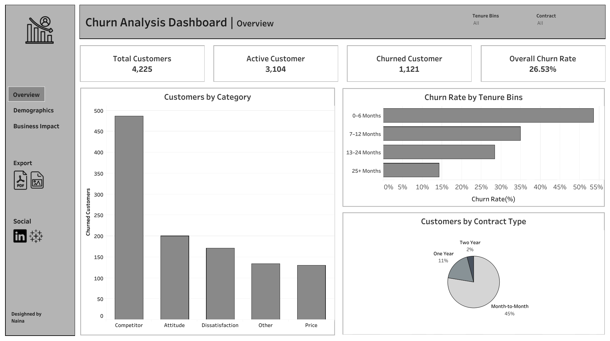

# Customer-Churn-Analysis

I built a Customer Churn Analysis Dashboard to Identify why customers are leaving, and how to retain it. I built this project using Excel for data cleaning and Tableau for creating interactive dashboards.

## Objective

To understand **why customers are leaving**, identify key factors contributing to churn, and visualize these insights through an interactive dashboard using Excel, SQL and Tableau.

---

## Tools & Technologies

- **Excel** - Data cleaning and preparation
- **MySQL** – Data analysis using SQL queries
- **Tableau** – Interactive dashboard creation

---

## Key Steps

1. **Data Cleaning & Preparation**:
   - Handled missing values and outliers
   - Remove duplicates and data allignment

2. **Exploratory Data Analysis (EDA)**:
   - Identified churn trends by tenure, contract type, services used, etc.

3. **SQL Analysis**:
   - Wrote queries to extract churn insights and KPIs

4. **Dashboard Creation**:
   - Built a Tableau dashboard with filters for customer segments

---

## Dashboard Snapshot

> You can view the interactive version here: [Tableau Public Dashboard](https://public.tableau.com/app/profile/naina.sonkar/viz/CustomerChurnAnalysis_17466181690340/Dashboard1)

## Contact

Feel free to reach out:

-  [LinkedIn](https://www.linkedin.com/in/nainasonkar/)
-  Email: sonkarnaina310@gmail.com

## Thankyou!
